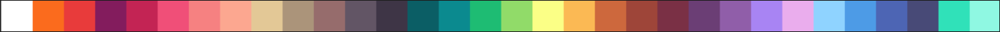
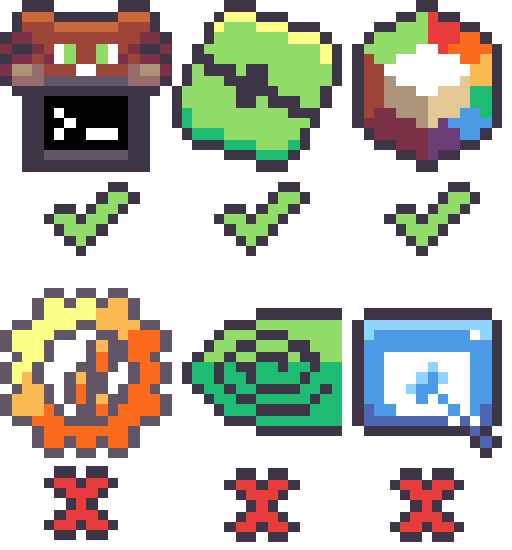

# pixora-theme Design Guidelines

***These Guidelines are still work-in-progress and are subject to change!***

If you want to make icons for pixora-theme, these guidelines should point you to the right direction. Although they are not that strict, you should still keep them in mind for consistency reasons.

# General App Guidelines

These guidelines apply to every app, be it Discord, Firefox, Steam (branded apps); or Settings, Accessibility, File Manager (non-branded apps).

## Taking References

You're free to use any version you want from any app icon for reference, besides the really old ones if the app has been through many rebrandings. Also try to keep the designs consistent with existing ones!

## Color Palette
pixora-theme icons use a specific color palette. You can check it out by clicking [here](https://lospec.com/palette-list/resurrect-32)!
This, together with the vectorizing rule, should be the only rule that is very strict. Please refrain from using any color outside of the 32 ones that Resurrect offers, as this would ruin the general aesthetic of your icon when comparing it with the rest.

Be creative with your designs! If you're not that deep into art, many times you'll think that it's impossible to draw an icon without a specific color, but it is very much possible if you try hard enough. 
You're free to tweak the original icon aesthetic as much as you want, as long as it does not make it unrecognizable. Have fun!

Visual representation of the color palette:

## Borders

Every app icon has a border. Its purpose is to keep the icons 'away' from any background color and define their own space on the screen. Since they are all drawn on a 16x16 grid, every color matters, and avoiding background fading is super important. 

A border has three simple criteria:
- It should be colored `#3E3546`;
- It should go around the **entire** icon (so avoid coloring the edges of the grid as much as possible);
- If the icon has any "hollow" (transparent) section, or an internal border (think of a donut shape) it should go there as well.

Here you can see examples of GOOD borders and BAD borders:

Why are those borders considered 'bad':

1. The first one has the wrong color (`#625565` instead of `#3E3546`);
2. The second one does not go all the way around, since there's a part of the icon on the edge of the grid. It is actually possible to make this border good — the icon width is 14px;
3. The third one only goes around the external part of the icon, leaving the inside region incomplete.

## Shading

Every icon should have some sort of shading, except monochromatic ones (eg.: GitHub, Monochrome, Hydra Launcher), and rare exceptions, like Nvidia's, where it kind of has some shading originally already, and that is enough. This is to keep visual consistency between the icons.

Shading is (most of the time) done assuming the light source is above the object, so a lighter tone on the top part and a darker one on the bottom part should suffice. It is also quite simplistic, so a single-pixel line should be enough.
This is when the limitations of the 32-color palette shine the most!

Example of shaded vs non-shaded versions of the same icon:

## Glyphs and General Advice

Keep in mind that pixel art is not about taking the full resolution version of an image and resizing it down; it's actually redrawing it from scratch, where every single pixel matters and actually represents a significant portion of the whole image. You can see this clearly on this project, since we're limited to mere 256 pixels IN TOTAL for every single image. 

When drawing the glyph of any app, try to think which portion of the whole image the last pixel(s) you've drawn actually represents. You'll be surprised of how often you notice that the final result is getting distorted, and you'll know exactly why by applying this thought process.

## Vectorizing

Every app icon should be vectorized. Reason being, I think it's way easier to, in this project's case, make every icon a vector and set the theme to `scalable`, than having to make 16, 24, 32, 64px and so on versions of every single icon. 
The process should be fast and simple enough to follow, so it's actually not a time sink to do so for every design.

### Tutorial:

1. After finishing your design on your favorite 16x16 canvas, **upscale** the icon to 512x512 (no need for more than that) using the `Nearest-neighbor` option. You may save the icon in this resolution, as it is not the final product. You can always downscale back to 16x16 by `Nearest-neighbor` if anything.

[ example on LibreSprite ]

2. Open your file on **Inkscape**.

3. Left-click the image of your icon inside the canvas to select it.

4. Using the `W:` (width) and `H:` (height) fields you see at the top of the window, *downscale* the icon back to 16x16 (this optimizes file size):

5. Press `Shift+Ctrl+R` or go to `Edit > Resize Page to Selection` to make the canvas fit the new icon size.

5. Press `Shift+Alt+B` or go to `Path > Trace Bitmap...` to open the bitmap tracing tab.

4. Inside the tab that just opened in the right section, go to `Multicolor`, and under `Detection mode:`, select `Colors` (remember to keep your icon image selected):

[ image ]

5. Using the `Scans` slider (or the `+` and `-` icons), tweak the amount until EVERY original color of the icon is present on the preview, and the background is black:
> If you don't see a preview during this process, the image is most certainly not selected.

[ video example ] 

6. Click `Apply` to apply your changes. You should now have a new object perfectly positioned above the original image that you can drag and zoom around (if you really end up doing that, don't forget to `Ctrl+Z` to revert it back into place <:).

7. Go to `File > Export...` to export your file. Make sure it is `Plain SVG (*.svg)` extension.

8. All done! You now have a beautiful, vectorized, 16x16 pixel art icon that can be resized to any resolution without losing a single detail. :)
