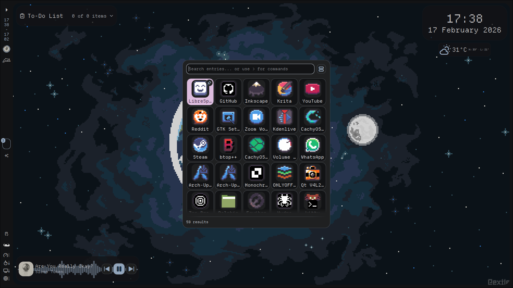

# pixora-theme
Taking the legacy of an archived 16-bit icon theme and adding my own work to it.
<br><br>

# 📷 Screenshots

*An example of how the icons look on a desktop environment, featuring noctalia-shell.*
<br><br>

*A better view of the icons style.*

<br>

# 🖥️ How to Install

## 1. Clone the repo 
```bash
git clone https://github.com/tsora1603/pixora-theme.git
cd pixora-theme
```

## 2. Launch the Installation Script
This will either: <br>
a. Symlink the files into place, allowing for easy updates by running `git pull`; <br>
b. Copy-paste the files in the right directories, allowing for a fully local installation.

```bash
./install.sh
```

> _If install.sh doesn't run, try ```chmod +x install.sh```_

<br>

# 🎨 How to contribute with art
You'll need:

1. A pixel art editor ([LibreSprite](https://libresprite.github.io/#!/) is great!);
2. 16x16 canvas size;
3. Make use of the [Resurrect 32 color pallete](https://lospec.com/palette-list/resurrect-32) for consistency;
4. Inkscape to vectorize the icons.

<br>

# 👥 CREDITS
- Inspired by **MrDeltaMan**: https://github.com/MrDeltaMan/DeltaPixel-Theme
- Original work by **maxtron95**: https://github.com/maxtron95/tuxonpixels-icon-theme
- Fallback and all non-application icons by **ItsZariep**: https://github.com/ItsZariep/pixelitos-icon-theme

> ⚠️  Note:
The pixelitos icon theme is going to be dropped as soon as I develop my own versions of all the icons it covers.
