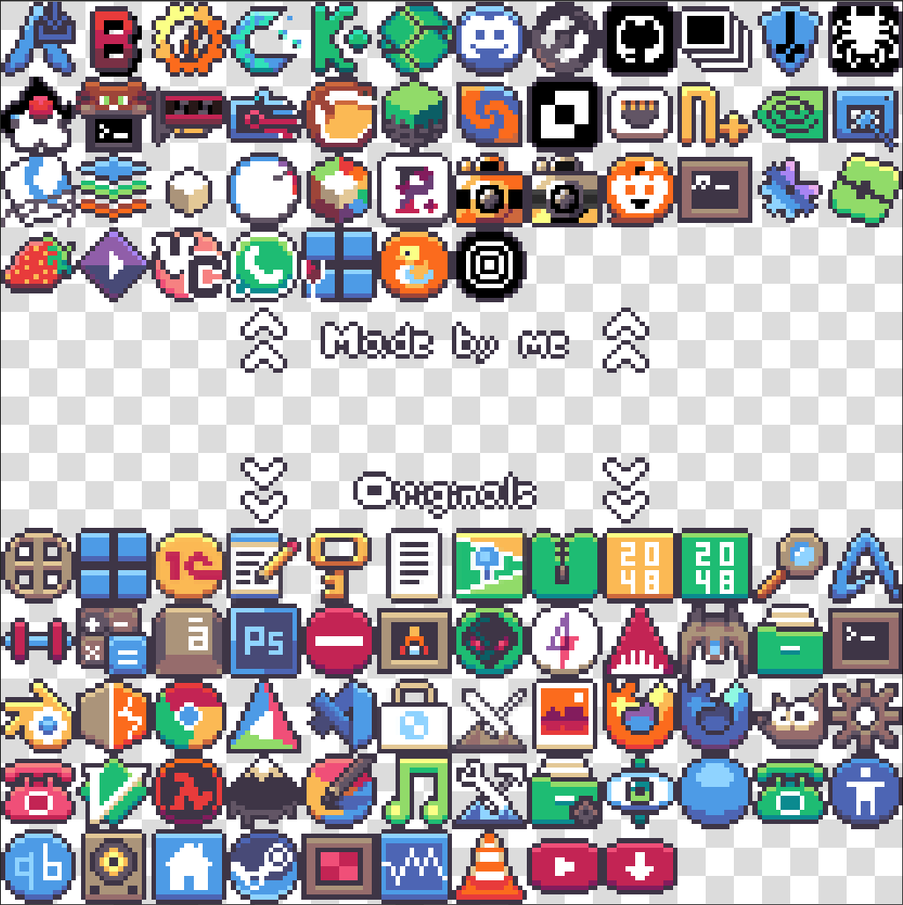

# pixora-theme
Taking the legacy of an archived 16-bit icon theme and adding my own work to it.

>[!Note]
> pixora-theme is being updated regularly. In case you want an icon to be added, please open a new issue.

# 📷 Screenshots
#### Icons on an app launcher, featuring noctalia-shell:


<br>

#### Icons full showcase:


<br>

# 🖥️ How to Install

## 1. Clone the repo 
```bash
git clone https://github.com/tsora1603/pixora-theme.git
cd pixora-theme
```
<br>

## 2. Launch the installation script
This will either: <br><br>
a. Symlink the files into place, allowing for easy updates by running `git pull`; <br>
b. Copy-paste the files in the right directories, allowing for a fully local installation.

```bash
./install.sh
```

> _If install.sh doesn't run, try ```chmod +x install.sh``` and then run it again._

<br>

# 🎨 How to Contribute
Want to contribute to the project? Check our [Contributing](CONTRIBUTING.md) and [Design](DESIGN.md) Guidelines!

<br>

# 👥 CREDITS
- inspired by **MrDeltaMan**: https://github.com/MrDeltaMan/DeltaPixel-Theme
- original work by **maxtron95**: https://github.com/maxtron95/tuxonpixels-icon-theme
- fallback and all non-application icons by **ItsZariep**: https://github.com/ItsZariep/pixelitos-icon-theme

> ⚠️  Note:
The pixelitos icon theme is going to be dropped as soon as I develop my own versions of all the icons it covers.
